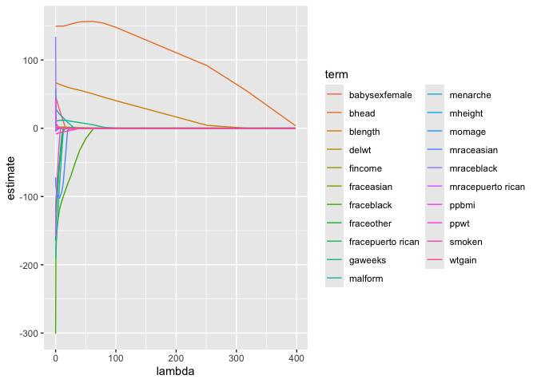
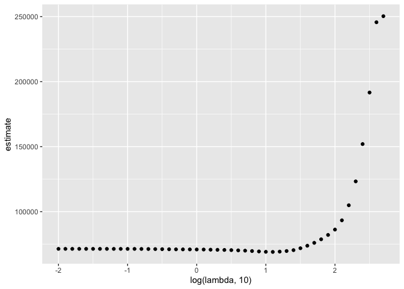
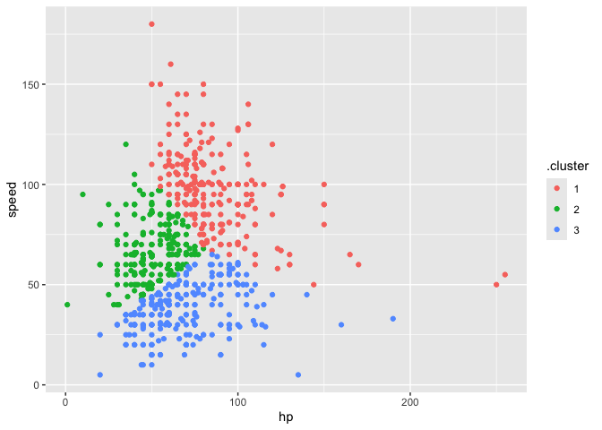

Statistical learning
================

Learning from data - Supervised learning \* There’s an outcome you care
about, and what you learn depends on that outcome \* Regression,
lasso/elastic net, regression trees, support vector machines

- Unsupervised learning
- You just have data and want to learn stuff - probably find patterns or
  identify subgroups
- Clustering, principle components, factor analysis

Regression Regression is interested in the condiitonal distribution of
an outcome Y given some predictors x Regression has a lot of benefits.

**Lasso** \* One drawback of regression is lack of scalability - When
you have some covariates, you have model-building options. \* When you
have a lot of covariates, you have fewer options. Lasso is useful when
you have a lot of coefficients and few strong hypotheses - Goal is a
regression-like model that “automatically” selects variables.

Lasso adds a penalty on the sum of all coefficients. You want fewer
coefs and their values to be small. Lambda is the penalty term. \* Coefs
that are larger have more penalty. If you have a coef that doesn’t do
any good for the RSS (resid sum squares), make it smaller. If it’s not
significant, set it to 0.

Penalized estimation forces some coefficients to be 0, which effectively
removes some covariates from the model. Result has a similar form to
regression.

There are some drawbacks - No inference / p-value - Very different
interpretation - Have to choose the tuning parameter to maximize
prediction accurcy - Coefs for included covariates i not the same as in
a regression using only those covariates.

**Tuning paratmer selection** min_b(RSS(b) + lambda_p(b)) For any tuning
parameter value, Lasso returns coefficient estimates These can be used
to produce predicted values based on covariates. Tuning parameters are
frequently chosen using cross validation. - Split the data into training
and testing sets - Fit lasso for a fixed tuning parameter using training
data - Compare observations to predictions using testing data - Repeat
for many possible tuning parameter values - Pick the tuning parameter
that gives the best predictions for “held out” testing data.

**Clustering** - Broad collection of techniques that try to find
data-driven subgroups - Subgroups are non-overlapping, and every data
point is in one subgroup. - Data points in the same subgroup are more
simlilar to each other than to points in another subgroup

Have to define “similarity” You can usually ell if clustering worked if
it looks right

## Try Lasso

``` r
bwt_df =
  read_csv("data/birthweight.csv") |> 
  janitor::clean_names() |> 
  mutate(
    babysex = 
      case_match(babysex,
                 1 ~ "male",
                 2~ "female"),
    babysex = fct_infreq(babysex),
    frace = 
      case_match(frace,
        1 ~ "white",
        2 ~ "black", 
        3 ~ "asian",
        4 ~ "puerto rican",
        8 ~ "other"
      ),
    frace = fct_infreq(frace),
    mrace = 
      case_match(mrace,
        1 ~ "white",
        2 ~ "black", 
        3 ~ "asian",
        4 ~ "puerto rican",
        8 ~ "other"
      ),
    mrace = fct_infreq(mrace)
  ) |> 
  sample_n(200)
```

    ## Rows: 4342 Columns: 20
    ## ── Column specification ────────────────────────────────────────────────────────
    ## Delimiter: ","
    ## dbl (20): babysex, bhead, blength, bwt, delwt, fincome, frace, gaweeks, malf...
    ## 
    ## ℹ Use `spec()` to retrieve the full column specification for this data.
    ## ℹ Specify the column types or set `show_col_types = FALSE` to quiet this message.

Construct inputs for `glmnet`. Main package for fitting Lasso.

``` r
x = model.matrix(bwt ~., data = bwt_df)[, -1] #fit birthweight against everything using bwt dataframe. 
y = bwt_df |> pull(bwt)
```

Fit lasso for several lambdas As lambda is at its max, it shrunk all
coefs to 0. As lambda decreases to 0, we’re simply doing least squares
regression.

``` r
lambda = 10^seq(-2, 2.75, by = 0.1)

lasso_fit = 
  glmnet(x = x, y = y, lambda = lambda)
```

Usual lasso plot

``` r
lasso_fit |> 
  broom::tidy() |> 
  filter(term != "(Intercept)") |> 
  select(term, lambda, estimate) |> 
  complete(term, lambda, fill = list(estimate = 0)) |> 
  ggplot(aes(x = lambda, y = estimate, group = term, color = term)) +
  #geom_vline(xintercept = lambda_optimal) +
  geom_line()
```

<!-- -->

What is lasso telling that’s the right model I should fit?

``` r
lasso_cv = 
  cv.glmnet(x = x, y = y, lambda = lambda)

lambda_optimal = lasso_cv[["lambda.min"]]
```

``` r
final_lasso_fit = 
  glmnet(x = x, y = y, lambda = lambda_optimal) |> 
  broom::tidy()
```

Look at CV results

``` r
lasso_cv |> 
  broom::tidy() |> 
  ggplot(aes(x = log(lambda, 10), y = estimate))+
  geom_point()
```

<!-- -->

## Clustering pokemons

``` r
pokemon_df =
  read_csv("data/pokemon.csv") |> 
  janitor::clean_names() |> 
  select(hp, speed)
```

    ## Rows: 800 Columns: 13
    ## ── Column specification ────────────────────────────────────────────────────────
    ## Delimiter: ","
    ## chr (3): Name, Type 1, Type 2
    ## dbl (9): #, Total, HP, Attack, Defense, Sp. Atk, Sp. Def, Speed, Generation
    ## lgl (1): Legendary
    ## 
    ## ℹ Use `spec()` to retrieve the full column specification for this data.
    ## ℹ Specify the column types or set `show_col_types = FALSE` to quiet this message.

``` r
pokemon_df |> 
  ggplot(aes(x = hp, y = speed)) +
  geom_point()
```

<!-- -->

Let’s use kmeans to cluster these pokemons

``` r
kmeans_fit = 
  kmeans(x = pokemon_df, centers = 3)
```

Can I plot these results

``` r
pokemon_df = 
  broom::augment(kmeans_fit, pokemon_df)
```

``` r
pokemon_df |> 
  ggplot(aes(x = hp, y = speed, color = .cluster)) +
  geom_point()
```

<!-- -->
